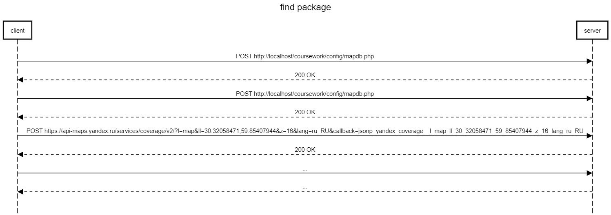
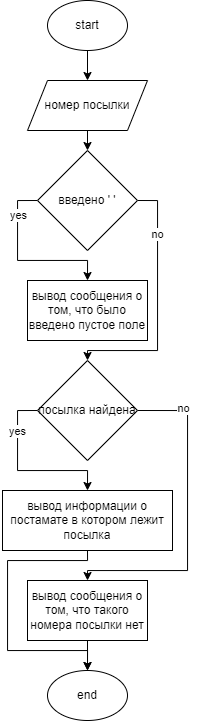

# Курсовой проект
### *По курсу "Основы Программирования"*

## Тема проекта

Система для автоматического хранения и выдачи посылок. В пользовательском приложении отображается карта постаматов и статусы посылок.

## Изучение предметной области

В сети Интернет существует множество сайтов отслеживания посылок. Все они предоставляют пользователю возможность найти и отследить конкретную посылку, а также постамат, в котором она будет дожидаться клиента. 

## Составление ТЗ

- Проектирование дизайна;
- Верстка сайта;
- Создание клинт-серверной части;
- Подключение Яндекс карт;
- Публикация проекта.

## Выбор технологий

*Платформа:* TimeWeb  
*Среда разработки:* Atom, OpenServer <br>
*Инструменты:* PHP 8.0, MySQL-8.0, Apache 2.4, PhpMyAdmin, JS <br>
*Фреймворк:* Bootstrap 5 <br>

## Реализация

### Пользовательский интерфейс

[1. Пользовательский интерфейс](https://www.figma.com/file/11kZzU4IsH81JzWCP3pSiW/IS_coursework?node-id=0%3A1&t=rhdQGkrOiiHCIQAt-1)

### Пользовательский сценарии

Пользователь попадает на главную страницу **index.php**. 
Пользователь может зарегистрироваться или войти если уже зарегистрирован. По нажатию на кнопку *Регистрация* или *Вход* происзодит переход на страницу *user.php*. Эту страницу можно покинуть с помощью кнопки *Выход*, а также произвести поиск по посылкам. 

### API сервера и хореография



### Структура базы данных

*package*
| Название | Тип | Длина | NULL | Описание |
| :------: | :------: | :------: | :------: | :------: |
| **id** | INT | - | - | id посылки |
| **pack_num** | INT | - | - | номер посылки |
| **pack_name** | TEXT | - | - | наименование посылки |
| **post_id** | INT | - | - | id постамата, в котором находится посылка |
| **delevery_time** | INT | - | - | время доставки |

*package*
| Название | Тип | Длина | NULL | Описание |
| :------: | :------: | :------: | :------: | :------: |
| **id** | INT | - | - | id посылки |
| **x** | INT | - | - | координата y |
| **y** | TEXT | - | - | координата x |
| **adress** | INT | - | - | адрес постамата |

*users*
| Название | Тип | Длина | NULL | Описание |
| :------: | :------: | :------: | :------: | :------: |
| **id** | INT | - | - | id пользователя |
| **nickname** | INT | - | - | имя пользователя |

### Алгоритмы

*find function*



### Значимые фрагменты кода

*Функция генерации точек на карте*
```js
for (let i = 0; i < points.length; i++){
    point = new ymaps.Placemark([points[i][1], points[i][2]],{
      balloonContentHeader: 'Постамат №' + (i+1),
      balloonContentFooter: points[i][3],
      balloonMaxWidth: 200
    }, {
      iconLayout: 'default#image',
      iconImageHref: 'https://img.icons8.com/color/512/database.png',
      iconImageSize: [30,30],
      iconImageOffset: [-15,-11],
    });
    let placemark_body = 'постамат пустой)';
    for (let j = 0; j < packs.length; j++){
        if(packs[j][3] == i){
            placemark_body = '';
            placemark_body += 'номер посылки: ' + packs[j][1];
            placemark_body += ', товар: ' + packs[j][2];
            if (packs[j][4] == 2 || packs[j][4] == 3){
                placemark_body += ', время доставки: ' + packs[j][4] + ' дня' + '<br>';
            }
            else if (packs[j][4] == 1){
                placemark_body += ', время доставки: ' + packs[j][4] + ' день' + '<br>';
            }
            else {
                placemark_body += ', время доставки: ' + packs[j][4] + ' дней' + '<br>';
            }
        } else {
        }
    }
    point.properties.set({ balloonContentBody: placemark_body});
    collection.add(point);
}
```
## Тестирование(smoketest)

После реализации проекта было выполнено smoke-тестирование (проверка ключевых функций проекта). Результаты показали ожидаеммые ответы, как на ошибочные, так и на корректные данные.

## Внедрение

Проект был опубликован в Интрнете через хостинг. Файловая организация анологична, как и на локальном сервере. Структура баззы данных была импортированна и имеет идентичный вид.
**Доступ к проекту:** 

## Поддержка
Добавление новых постаматов и посылок в DB, по мере их появления.
